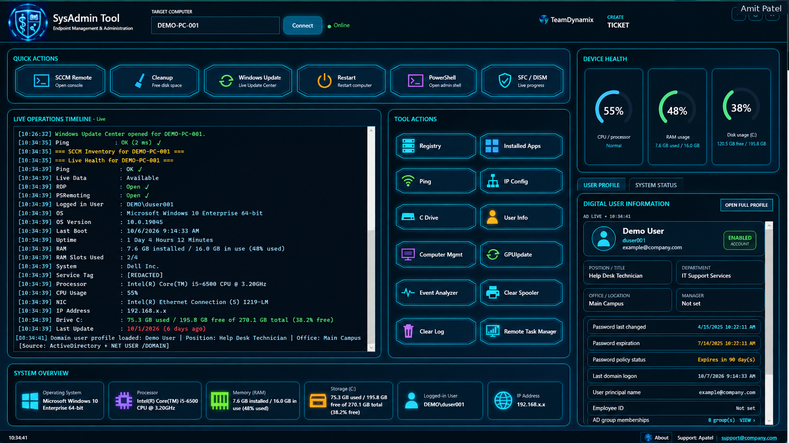
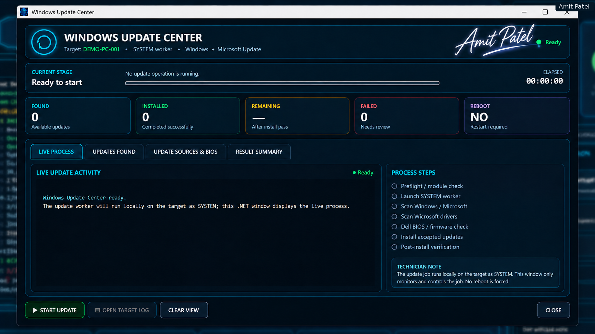
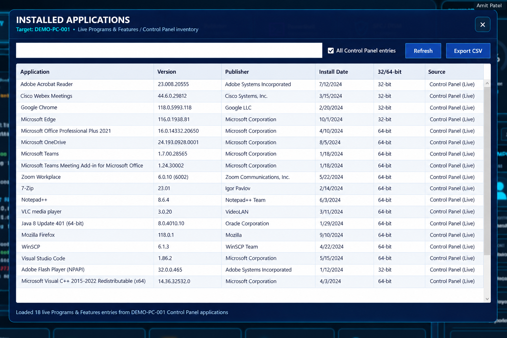
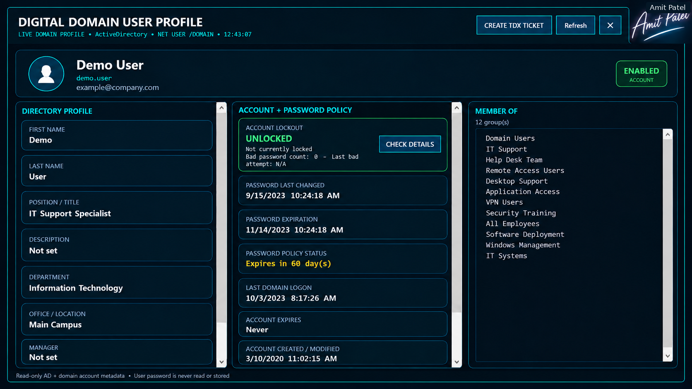
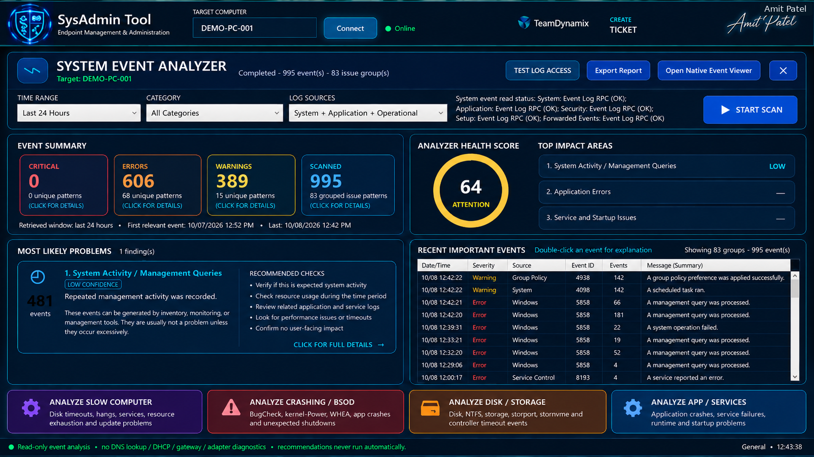
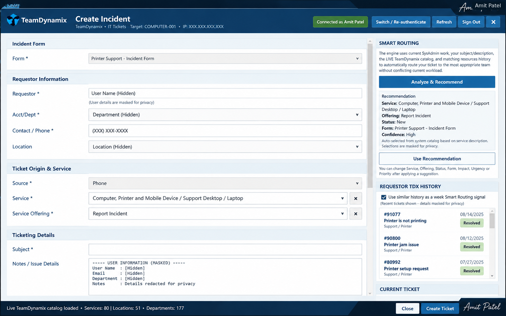

# Apatel SysAdmin Toolkit

**A Windows IT administration and remote support platform for enterprise helpdesk teams**


*Portfolio showcase by Amit Patel*

---

## Overview

**Apatel SysAdmin Toolkit** is a Windows desktop application that consolidates day-to-day IT administration tasks into a single, unified interface. Built with **C#, WPF, PowerShell, and .NET**, it gives support technicians access to endpoint diagnostics, system maintenance, hardware inventory, and repair workflows without switching between many separate consoles and scripts.

The toolkit's design is informed by practical helpdesk workflows, with an emphasis on speed, reliability, and repeatability in managed Windows environments.

---

## Why This Tool Exists

Frontline IT support often means using many separate utilities: remote consoles, PowerShell windows, MMC snap-ins, and scripts. Gathering basic information can take time before troubleshooting even begins.

This toolkit aims to:

- **Centralize** common administrative actions in one desktop interface.
- **Standardize** diagnostic and repair steps.
- **Surface** important endpoint information first.
- **Present** PowerShell and WMI/CIM operations through a guided interface.

---

## Key Features

| Module | Description |
|---|---|
| 🌐 **Remote Diagnostics** | Connectivity testing, remote system information, and troubleshooting utilities |
| 🖥️ **Windows Management** | Remote administration and routine Windows maintenance workflows |
| 🧩 **Hardware Inventory** | Computer specifications, memory, storage, and hardware details through WMI/CIM |
| 🛠️ **Endpoint Management** | Tools for common desktop support operations on managed endpoints |
| 🔄 **Windows Update & Repair** | Windows Update status, repair operations, and system-health workflows |
| 📋 **Installed Applications** | Software inventory, publishers, versions, and installation details |
| 📊 **System Event Analyzer** | Event summaries, diagnostic categories, and troubleshooting guidance |
| 👤 **User Profile View** | Account status, directory information, and policy details |
| 🎫 **Ticket Management** | Incident entry and service-selection workflow concepts |
| ⚡ **Helpdesk Productivity** | Administrative utilities consolidated in a desktop interface |

---

## Application Screenshots

**Illustrative presentation mockups, not live system captures.** Identifying data has been replaced with fictional examples. The images show interface concepts and must not be interpreted as benchmark or security-test results.

### 1. Main Administration Dashboard

Remote tools, live status, hardware summaries, and technician actions in one interface.



### 2. Windows Update Center

Update lifecycle monitoring, checklists, progress tracking, and restart status.



### 3. Installed Applications Inventory

A consolidated view of installed software, versions, publishers, and system architecture.



### 4. Digital User Profile

Directory profile presentation, account status, and password policy information.



### 5. System Event Analyzer

An event monitoring interface for reviewing errors, warnings, and recommended diagnostic checks.



### 6. Ticket Management Interface

An example incident creation screen with service selection and smart routing concepts.



---

## Technology Stack

| Layer | Technology |
|---|---|
| **Language** | C# |
| **Framework** | .NET |
| **User Interface** | Windows Presentation Foundation (WPF) |
| **Automation** | PowerShell |
| **System Data** | Windows Management Instrumentation (WMI / CIM) |
| **Platform** | Windows 10 / Windows 11 |

---

## Architecture at a Glance

```text
┌───────────────────────────────────────────────┐
│             WPF Desktop Interface             │
│       Technician views and workflows          │
└───────────────────────┬───────────────────────┘
                        │
┌───────────────────────▼───────────────────────┐
│          C# / .NET Application Layer          │
│       Orchestration, validation, logging      │
└────────────┬──────────────────────┬───────────┘
             │                      │
┌────────────▼───────────┐ ┌────────▼───────────┐
│    PowerShell Engine   │ │     WMI / CIM      │
│   Automation scripts   │ │  System inventory  │
└────────────┬───────────┘ └────────┬───────────┘
             │                      │
             └──────────┬───────────┘
                        ▼
             Windows Endpoints
```

---

## Design Principles

- **Technician-first UX** — Organize screens around everyday support tasks.
- **Deliberate administration** — Present administrative operations with clear controls.
- **Native Windows tooling** — Leverage PowerShell and WMI/CIM capabilities.
- **Maintainable structure** — Separate the interface, application logic, and automation components.

---

## Project Status

**🔒 Portfolio Showcase — Not Available for Public Download**

This repository describes the design and capabilities of the toolkit. **Source code, executable files, internal configurations, and enterprise integrations are not publicly distributed.**

---

## Security & Confidentiality

This showcase is intended to contain no organizational credentials, internal server details, private network information, or confidential operational records. The screenshots are **synthetic presentation visuals** rather than production captures.

Materials should be published only after any required organizational or intellectual-property approval. Images are provided for demonstration and should be reviewed prior to posting.

---

## About the Developer

**Amit Patel** — Windows IT professional focused on:

- Enterprise endpoint administration
- PowerShell automation
- C# / WPF desktop application development
- Practical support workflow improvement

I enjoy developing tools that simplify repetitive administrative tasks and make technical information easier to act on.

---

*Built for the people who keep endpoints running.*

**Amit Patel · Portfolio Showcase**
